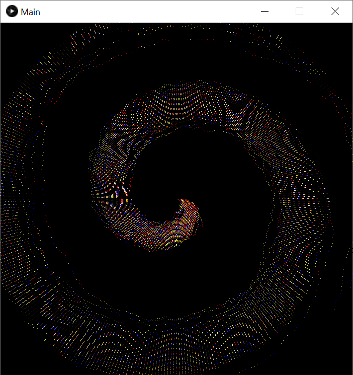

# Spiral Demo for Ants on Multiple Graphs

## Prerequisite

1. JDK 16+ and Apache Maven
2. AntsOMG Framework 2.0.8+ (A newer compatible version `2.1.0-CEC` is available in [om.composer](https://github.com/nclab/om.composer/tree/main/code/antsomg) repository)
3. GUI environment required for Processing-Java

## Build

```java
mvn clean package
```

## Run

### Without random seed

```java
mvn exec:java
```

### Example with random seed 1637579158

```java
mvn exec:java -Dexec.args=1637579158
```

### Output

```plaintext
SpiralSystem initialized with seed = 1637579158
digraph Graph_Y {
        WHITE -> WHITE [ label=<c=1.0, pher=1.72> ];
        BLUE -> BLUE [ label=<c=1.0, pher=6.09> ];
        RED -> RED [ label=<c=1.0, pher=2.66> ];
        YELLOW -> YELLOW [ label=<c=1.0, pher=1.92> ];
        WHITE -> BLUE [ label=<c=5.0, pher=1.31> ];
        BLUE -> WHITE [ label=<c=10.0, pher=0.91> ];
        WHITE -> RED [ label=<c=5.0, pher=0.67> ];
        RED -> WHITE [ label=<c=10.0, pher=0.80> ];
        WHITE -> YELLOW [ label=<c=5.0, pher=1.48> ];
        YELLOW -> WHITE [ label=<c=10.0, pher=1.60> ];
}
digraph Graph_X {
        STAY -> IN [ label=<c=10.0, pher=2.56> ];
        IN -> STAY [ label=<c=1.0, pher=1.38> ];
        STAY -> OUT [ label=<c=1.0, pher=2.05> ];
        OUT -> STAY [ label=<c=10.0, pher=3.65> ];
        IN -> OUT [ label=<c=1.0, pher=1.32> ];
        OUT -> OUT [ label=<c=500.0, pher=5.52> ];
        STAY -> STAY [ label=<c=1.0, pher=2.68> ];
}
```


